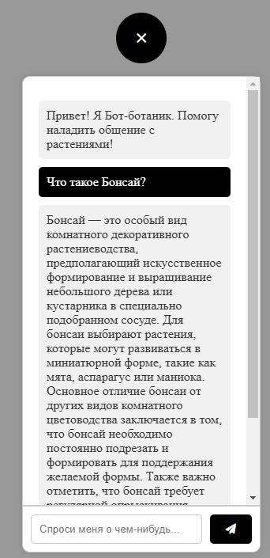

Чтобы с нуля запустить приложение необходимо:
1) Локально развернуть ollama c моделями llama3.1:8b и snowflake-arctic-embed:22m (https://ollama.com/);
2) Сгенерировать базу знаний путем запуска langModel.py (или использовать уже созданную в папке chroma);
3) Запустить flaskApp.

   

